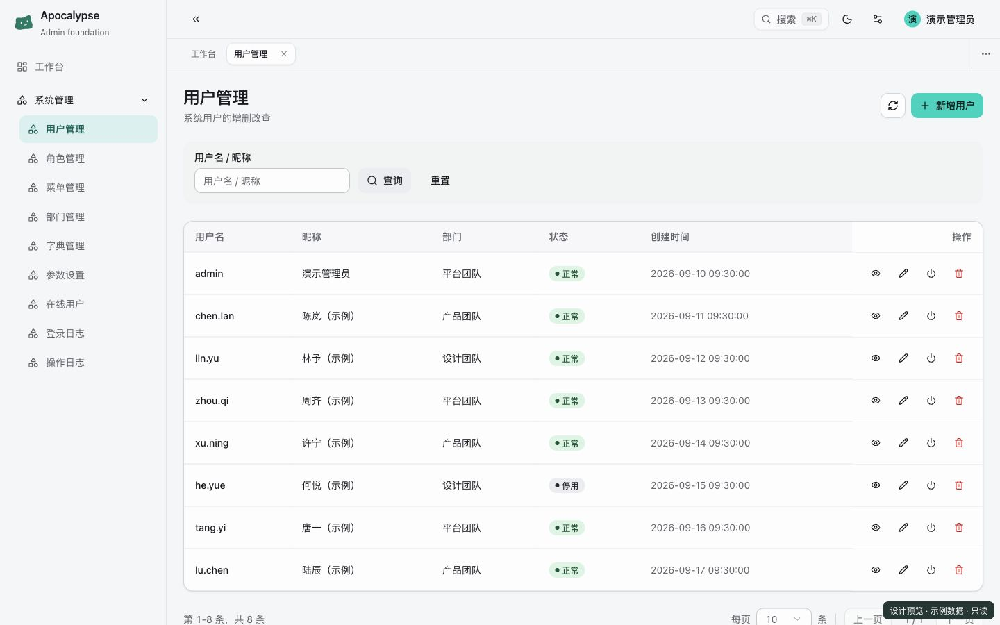
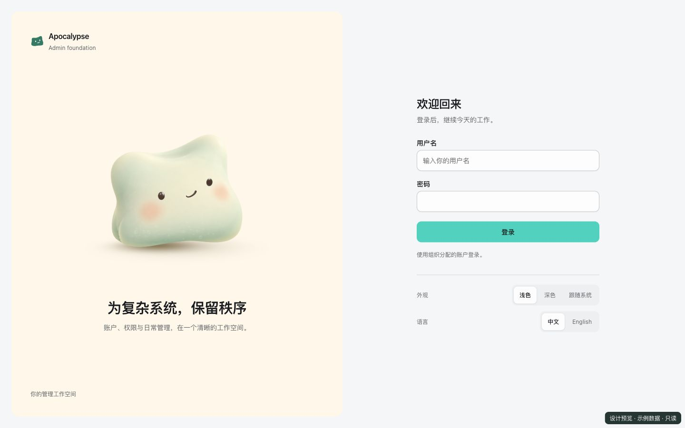

<picture>
  <source media="(max-width: 600px) and (prefers-color-scheme: dark)" srcset=".github/assets/readme/hero-mobile-dark.png">
  <source media="(max-width: 600px)" srcset=".github/assets/readme/hero-mobile-light.png">
  <source media="(prefers-color-scheme: dark)" srcset=".github/assets/readme/hero-dark.png">
  
</picture>

<p align="center">
  <strong>让业务从一个更好的起点开始。</strong><br>
  Java 模块化单体 × React 管理台，为你的下一套业务系统打好基础。
</p>

<p align="center">
  <a href="docs/release.md"></a>
  <a href="https://github.com/lilibonk/apocalypse/actions/workflows/ci.yml"></a>
  <a href="LICENSE"></a>
</p>

<p align="center">
  <a href="docs/getting-started.md"><strong>快速开始</strong></a> ·
  <a href="#界面一览">界面一览</a> ·
  <a href="docs/module-development.md">开发业务模块</a> ·
  <a href="docs/README.md">使用文档</a> ·
  <a href="CHANGELOG.md">更新记录</a>
</p>

## 界面一览

薄荷绿的操作强调、清晰的内容层级，还有一只柔软的 Apo。管理台支持明暗主题、中英文、两档密度与响应式布局，让日常管理也有一点轻快感。

<picture>
  <source media="(prefers-color-scheme: dark)" srcset=".github/assets/readme/admin-dark.jpg">
  
</picture>

<p align="center"><sub>当前管理台组件 · 示例数据 · 随阅读环境切换明暗展示</sub></p>

<details>
<summary><strong>认识 Apo：登录页的品牌宠物</strong></summary>

Apo 的 Milk Cloud 造型也出现在首页首图中。在支持 WebGPU 的浏览器里，它能跟随视线、回应按压与拖拽；输入密码时会闭上眼睛，等待、成功和出错时也有对应表情。关闭动效或浏览器不支持时，仍以静态形象陪伴登录。

<picture>
  <source media="(prefers-color-scheme: dark)" srcset=".github/assets/readme/login-dark.jpg">
  
</picture>

</details>

## 为什么选择 Apocalypse

### 一个后端制品，清楚的业务边界

后端保留**单 Maven 模块**，业务域各自拥有明确入口和对外 facade。Spring Modulith 与 ArchUnit 把边界变成可执行检查，让项目从第一天就有清楚的结构，也能沿着同一套约定继续扩展。

### 从权限到页面，基础已经配套

用户、角色、部门、菜单和审计已有完整管理界面。权限覆盖菜单、按钮与部门数据范围；标准 CRUD 页面通过 DynaLayer 声明筛选、表格和表单，业务模块可复用现成控件与查询生命周期。

### 把质量检查带进开发流程

后端检查架构、迁移、安全和集成行为，前端检查类型、组件与真实浏览器交互。模块启停、撤权和换号后的旧请求处理都有回归覆盖，新业务可以沿用同一套门禁。

## 开箱有什么

| 能力       | 已有内容                                                                                    |
| ---------- | ------------------------------------------------------------------------------------------- |
| 系统管理   | 用户、角色、菜单与按钮权限、部门、字典、参数、在线会话                                      |
| 数据权限   | 全部数据、本部门、本部门及子部门三档范围，以及用户归属数据的对象授权约定                    |
| 登录与安全 | Spring Security / JWT、内存 access token、HttpOnly refresh cookie、CSRF、登录限流与失败锁定 |
| 审计与运行 | 登录 / 操作日志、统一脱敏、TraceId、OpenAPI、健康检查                                       |
| 数据与缓存 | MyBatis-Plus、Flyway、PostgreSQL、Redis / Caffeine 两级缓存                                 |
| 前端体验   | 明暗主题、中英文、响应式布局、多页签、全局搜索与 DynaLayer CRUD                             |
| 可选能力   | Calendar 试验模块：默认关闭，以服务端开关统一控制暴露面                                     |

<details>
<summary><strong>技术栈与目录</strong></summary>

| 后端                                            | 前端                                    |
| ----------------------------------------------- | --------------------------------------- |
| Java 25 · Spring Boot 4.1 · Spring Modulith 2.1 | React 19 · TypeScript · Vite 7          |
| Spring Security · MyBatis-Plus · Flyway         | Tailwind CSS 4 · shadcn/ui · Radix UI   |
| PostgreSQL 18.6 · Redis 8.10.1 · Caffeine       | TanStack Query · Zustand · React Router |
| ArchUnit · Testcontainers                       | Vitest · Playwright                     |

```text
src/main/java/io/apocalypse/
├── common/             共享契约与通用模型
├── framework/          安全、缓存、Web 与模块装配
├── system/             系统管理业务域
└── calendar/           可选万年历业务域

apocalypse-web/src/
├── components/         共享控件、布局与 DynaLayer
├── lib/                API 与查询生命周期
└── views/              按业务域组织的页面
```

</details>

## 在本地跑起来

准备 **JDK 25、Docker Compose、Node.js 24、pnpm 11.19.0**。Maven 已通过 Wrapper 随仓库提供。

```bash
git clone https://github.com/lilibonk/apocalypse.git
cd apocalypse
```

按[快速开始](docs/getting-started.md#1-准备本地服务和一次性管理员密码)设置当前 shell 的私有 JWT 签名密钥与一次性管理员密码，然后启动后端：

```bash
docker compose up -d
./mvnw spring-boot:run
```

另开终端，在仓库根目录启动管理台：

```bash
cd apocalypse-web
pnpm install --frozen-lockfile
pnpm dev
```

访问 [http://localhost:5173](http://localhost:5173)，使用 `admin` 和刚才设置的密码登录。首次成功启动后移除一次性密码变量，后续启动不会重置管理员密码。Windows、环境排查与完整命令见[快速开始](docs/getting-started.md)。

> 首版从 `V1__init.sql` 初始化，仅支持空库。已有开发期数据库请先按[开发库重建](docs/operations.md#开发库重建)处理；首版基线冻结后只追加新迁移。

## 开始构建你的业务

先读[模块开发指南](docs/module-development.md)：划分业务域，声明模块入口，接入权限与迁移，再添加页面。标准列表优先复用 DynaLayer；复杂业务保留自己的页面与编排。

```bash
# 仓库根目录：后端全量检查
./mvnw --batch-mode verify

# 前端目录：格式、lint、单元测试与构建
cd apocalypse-web
pnpm check
pnpm test:browser
```

| 你要做什么         | 从这里开始                                                                    |
| ------------------ | ----------------------------------------------------------------------------- |
| 运行并登录项目     | [快速开始](docs/getting-started.md)                                           |
| 添加业务模块与页面 | [模块开发](docs/module-development.md) · [前端说明](apocalypse-web/README.md) |
| 部署、备份与升级   | [部署指南](docs/deployment.md) · [运行与升级](docs/operations.md)             |
| 启用 Calendar      | [Calendar 手册](docs/calendar/README.md)                                      |
| 确认版本支持范围   | [发行契约](docs/release.md) · [更新记录](CHANGELOG.md)                        |

## 当前版本与许可

当前为 **0.1.0-rc.1 预发布**，稳定版本尚未发布。[下载发布包与校验值](https://github.com/lilibonk/apocalypse/releases/tag/v0.1.0-rc.1)。项目适合以现有系统管理能力为基础开发独立业务域；支持范围与兼容政策见[发行契约](docs/release.md)。

本版不提供代码生成器、在线任务调度管理平台、公告、多租户或通用文件服务。Calendar 是默认关闭的试验模块，其代码与 Schema 随同一制品保留；早期 Order 运行 API 已退役，兼容表和事件桥仍保留。

项目自有部分采用 [Apache License 2.0](LICENSE)。直接移植的代码、素材和依赖保留原始授权，详见[第三方声明](THIRD_PARTY_NOTICES.md)。
