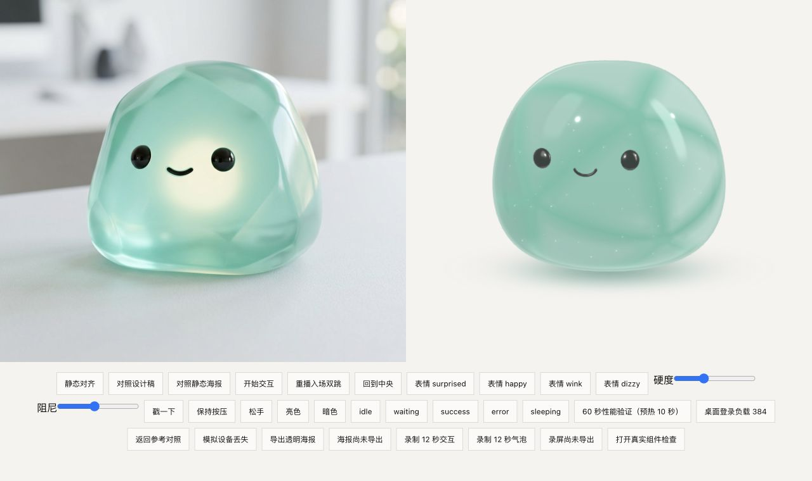
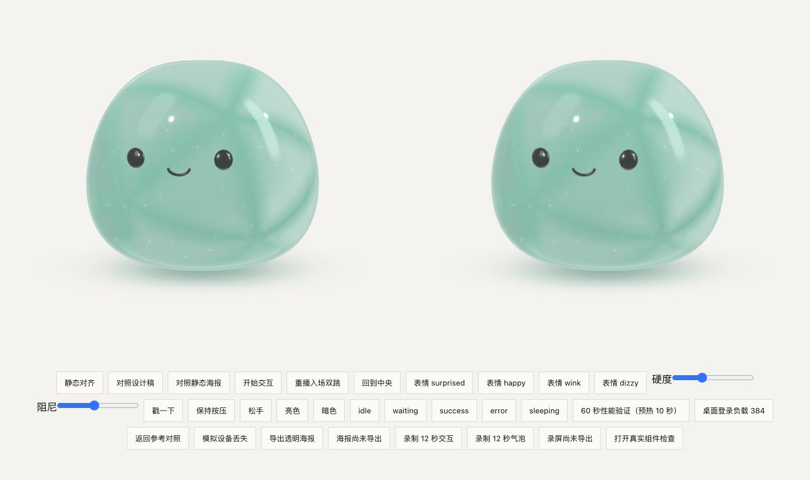
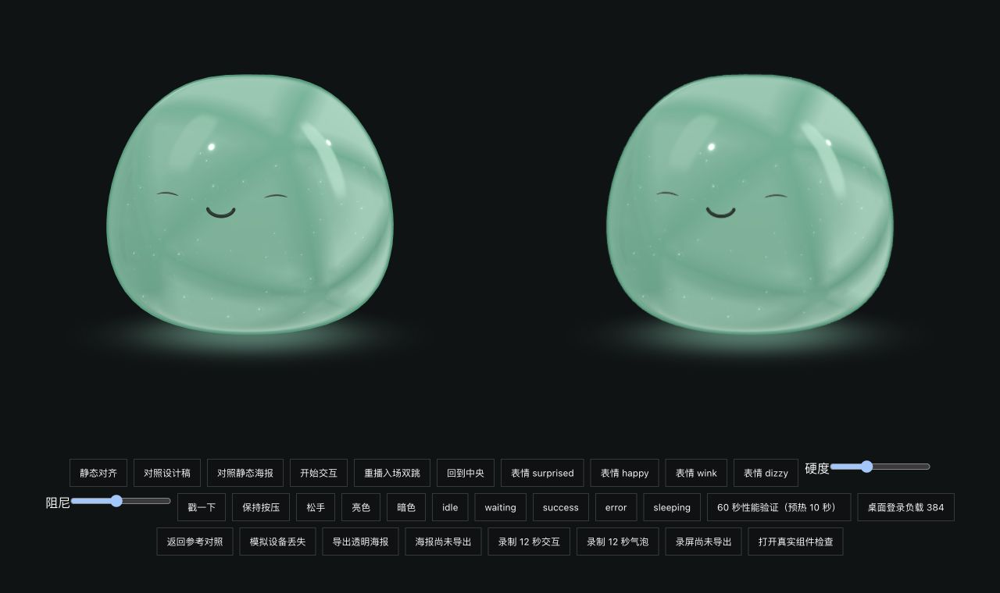

# Apo 第三版形象修正与视觉 QA

2026-09-25。设计基准为本目录的 [主视觉稿](apo-reference-idle.jpg) 与 [五状态稿](apo-reference-states.jpg)。两张图来自本产品的 Gemini 设计工件，仅用于目标对照。用户允许去掉腹部的内部光核；形态、脸部比例、柔和切面和海玻璃材质仍以主视觉稿为准。主视觉稿中的发光腹部不作为本轮匹配项。

实际页面截图：[桌面亮色](v3-login-light.jpg)、[桌面暗色](v3-login-dark.jpg)、[390px 暗色窄屏](v3-login-mobile-dark.jpg)。没有提交登录表单或使用真实账号。

## 修正

- 重做弹性外壳的宽高与顶部曲线，按设计稿调整画面占比和脸部偏左的布局。表面保留连续形变，宽切面通过随形变更新的法线和材质明暗表达。
- 删除 Gemini 加入的内部光核与状态脉冲。明度来自外部柔光、透射和接触反射；明暗主题由同一组 `--slime-*` token 驱动。
- 将降级用的明暗各五状态透明 PNG 从实际 WebGPU 场景重新导出为 1280×1280。之前把设计 JPEG 抠成 PNG 的海报与实时形象不一致，现已替换。

## 核查范围

- 独立验收页：`http://127.0.0.1:4174/docs/brand-slime/preview.html`。可在“对照设计稿”和“对照静态海报”之间切换；后者应与右侧静态实时画面同构图。
- 设备：macOS Apple Metal 3 的 WebGPU，640×640 CSS 画布，导出 DPR 2；检查亮色 idle、暗色 sleeping/error、五状态与透明海报。静态与实时的像素差异仅允许来自导出缩放/浏览器合成。
- 目标图为摄影风格概念稿。实时形象保持柔和多面海玻璃的辨识度，不把背景摄影布景硬编码进应用。照片的表面纹理与折射细节不逐像素复制；最终视觉接受仍由用户判断。

## 自动验证

`pnpm format`、`pnpm check`（49 个文件、350 项测试、TypeScript 与生产构建）、品牌 QA 构建均通过。仓库 `./mvnw --batch-mode spotless:apply` 和 `./mvnw --batch-mode verify` 均通过；集成测试 135 项，134 通过、1 跳过，Spotless 和 Checkstyle 无违规。未修改后端、公开 API、数据库或依赖版本。

实际浏览器在 Apple Metal 3 / WebGPU、640×640 CSS 与 DPR 1 上预热 10 秒，随后采集 60.01 秒：7201 帧、平均 120.00 FPS、p95 帧间隔 9.10 ms、超过 25 ms 的帧为 0。原始诊断见 [v3-performance-light.json](v3-performance-light.json)。这些是 rAF 帧间隔，不是 GPU 呈现时间；不推断其他设备或 DPR 2 的性能。
